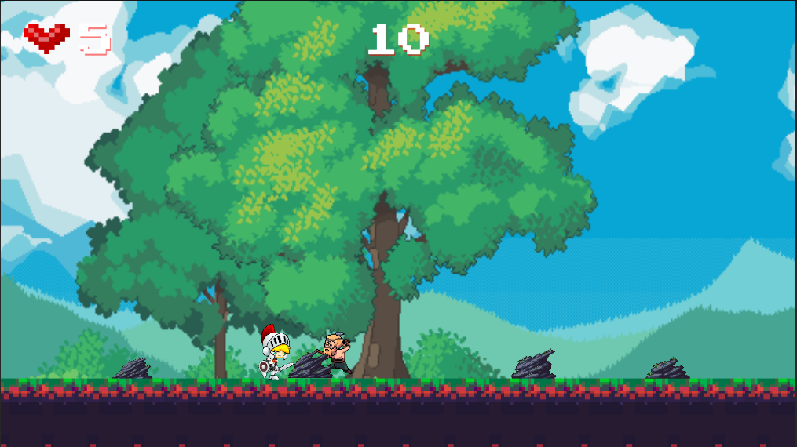

# RomanConqueror2D-Unity

This project is a classic 2D side-scrolling game set in the Roman era, featuring an agile Roman Gladiator as the main character.

## Game Idea
Roman Conquerer 2D is a challenging game where players guide a Roman Gladiator through various levels, battling enemies and avoiding obstacles. The game's goal is to reach 100 points, which triggers a dynamic change in the background and unlocks a victory chest upon successful completion.

## Game Proposal
The game delivers an exciting mix of action and strategy. Players must navigate the Gladiator through the game world, deftly moving, jumping, and earning points while dealing with enemies and impediments. Points are scored by defeating enemies and avoiding obstacles. Upon scoring 100 points, the game's background dynamically changes to reflect the Gladiator's increasing dominance, and a victory chest is unlocked, signaling the player's win.

## Screenshots

*Image 1. Game Start*

*Image 2. Player States "Run", "Jump", and Score Points"*

*Image 3. Background Change at 100 Points*

*Image 4. Player State "GameOver"*

*Image 5. Player Winning and Chest Open*

## How to Use the Project

1. Clone or download the project to your local machine.
2. Open Unity and select "Open Project".
3. Navigate to the downloaded project folder and select it.
4. Allow Unity to import all the necessary assets and project configurations.
5. Once the import process completes, select the main game scene.
6. Hit the play button to start experiencing the game.
